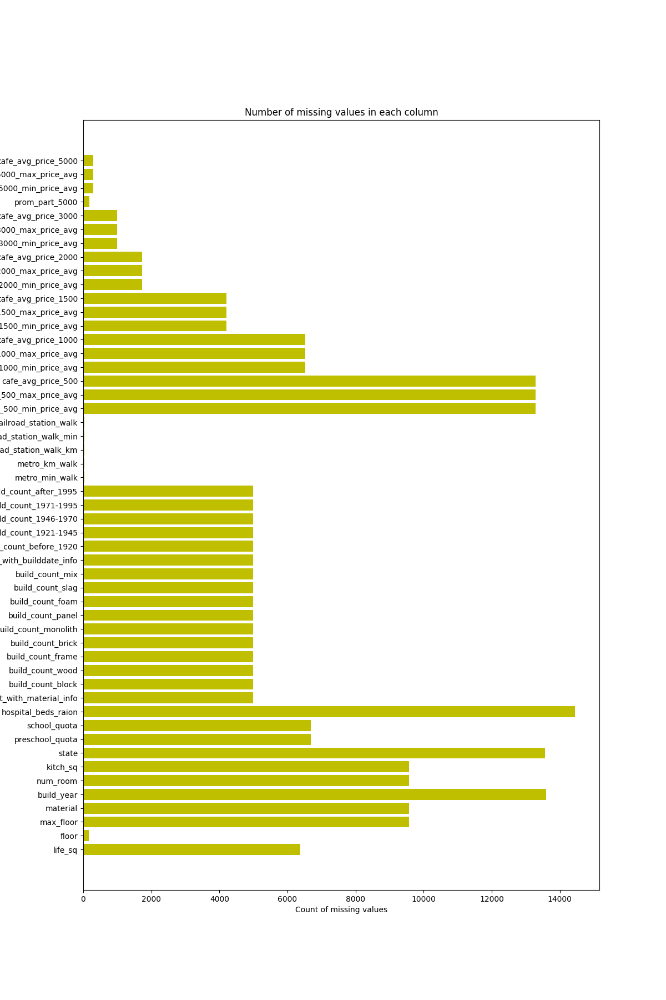

# 数据挖掘与建模的步骤总结

通过数据竞赛和项目中的数据挖掘和建模的落地项目，总结出一套工程化的数据挖掘和建模方法，记录于此，希望之后不断的优化总结
提高数据分析与数据建模的效率，将其运用到不同的行业之中

## 问题的抽象表示

## 数据探索

   数据探索的目标是希望对我们手里面已有的数据有一个充分的理解，为我们接下来的工程步骤做充分的准备；很多时候，这一步都在数据挖掘的流程中被忽略了，
但当你在数据建模做过足够多的优化方法之后，就会发现，数据探索对于一个项目来言是非常重要的一步；为之后的模型优化做出了重要的准备工作。

   对数据的探索性分析一般用到padnas和matplotlib就足够达到分析和数据可视化的要求了，一般来说我们的探索方向集中在几个方面：

1. 了解数据中每个特征维度的实际意义的来源；特征维度是连续的数值型还是离散的特征型；特征维度的统计信息

*示例：df.describe()*

|id|full_sql|life_sq|floor|max_floor|
|-|-|-|-|-|
|count | 30471.000000 | 30471.000000 | 24088.000000 | 30304.000000 | 20899.000000 |
|mean  | 15237.917397 |    54.214269 |    34.403271 |     7.670803 |    12.558974 |
|std   |  8796.501536 |    38.031487 |    52.285733 |     5.319989 |     6.756550 |
|min   |     1.000000 |     0.000000 |     0.000000 |     0.000000 |     0.000000 |
|25%   |  7620.500000 |    38.000000 |    20.000000 |     3.000000 |     9.000000 |
|50%   | 15238.000000 |    49.000000 |    30.000000 |     6.500000 |    12.000000 |
|75%   | 22855.500000 |    63.000000 |    43.000000 |    11.000000 |    17.000000 |
|max   | 30473.000000 |  5326.000000 |  7478.000000 |    77.000000 |   117.000000 |

2. 特征维度的分布情况，是否为正常的正太分布，还是有显著的分类规律；

*示例：特征分布*

3. 观察多个特征维度之间的相关性，链接特征维度之间的独立性和耦合情况；

*示例：相关性统计 *

4. 了解数据质量，查看数据缺失情况

* 示例：数据缺失值情况*

## 数据的预处理

1. 缺失数据的处理

缺失数据的处理一般可以粗略的分为三种情况：

  * 特征中的缺失数据的样本数量很小，可以是使用特征的平均值、众数或者由样本前后的样本数据进行填充；

  * 如果具有缺失值的特征与另一类型的特征的相关度非常的高，可以与其他特征之间建立简单的转换模型，由其他特征转化后进行填充；

* 特征中缺失值的比例非常的高，可以将特征值是否缺失作为另一个类别特征加入到数据维度之中

2. 通过数据探索过程中找到的数据集中的异常值，将数据集中的离群点剔除出数据集

3. 处理不平衡数据

  在数据集的构成中，很有可能会出现数据不平衡的情况，例如在反欺诈数据集中，我们就会发现有欺诈嫌疑的样本数量在整个数据集中的比例会非常的低，
这样的数据集对于模型的训练是非常不利的，所以需要我们对数据集进行重新的构造：采样、过采样、不同类别的数据使用不同权重等方式

## 特征工程

  理论上来说，特征工程应该也是属于数据预处理的一部分，不过该步骤实在是太过重要，所以将特征工程单独作为一个工作步骤提出

  在数据挖掘的竞赛中有一个经典的评论：数据挖掘的上限是由特征决定的，而模型和算法只是尽力的在逼近这个上限。由此可见特征工程在数据挖掘项目中的重要性。
  特征工程一般有以下的几种方式可以尝试：

1. 领域知识

  在一个特定的行业领域内专业知识是在数据挖掘过程中相当重要的一环，专业领域的知识和业务逻辑可以在数据集中添加一些有效的指标；根据经验，这些特征对数据建模也是相当有效的；

2. 数据维度的拓展

  在工程中经常使用到的是独热编码，也就是常说的one-hot encoding方法；这种方法是将类别特征映射为编码特征

3. 交叉特征/特征变换

4. 时序特征/时间窗口

5. 特征筛选/PCA

## 模型选择

  在建模过程中我们需要针对不同的问题进行不同的模型类型进行模型的设计

  * 分类问题： LR（逻辑回归）、SVM、树（决策树，随机森林）、模型融合（GBDT，xgboosting）
  * 回归问题: SVR、RF、GBRT、xgboosting
  * 规则模型/专家系统：结合实际业务规则，常用于打分系统，在不熟悉业务场景的情况下，可用于模型融合
  * 推荐系统：itemCF和userCF,频繁集挖掘apriori, FPGrowth,SVD,图算法

  其中xgboosting的算法在各大数据竞赛中已经作为主要的工具进行使用

## 模型融合

   随着数据挖掘应用的发展，单一的模型已经不能够满足模型性能的需求，在工程上一般会采用模型融合的方法对模型的正确率做进一步的提升；常用的模型融合方式有几种：
   * bagging：也就是对特征维度进行采样的方式训练多个子模型后进行融合，优点是可以减少方差，增强模型的稳定性
   
   * boosting：将多个模型作为基准模型，使用boosting的迭代框架计算每个基准模型的系数后进行融合，主要用于减少减少模型融合后的误差
   
   * stacking：该种融合方法为两层结构；第一层是将数据分为训练集和测试集后使用多个模型进行训练，将不同的模型在测试集中的结果融合后形成新的向量传入下一层；第二层使用前面模型产生的向量作为新的训练集，使用LR或者其他模型训练一个新的模型来预测测试集；
不过stacking的方法在小数据量的情况下容易产生过拟合的情况
   
   * ranking: 对多个基准模型的误差值进行排序后，多多个模型进行线性叠加；
   